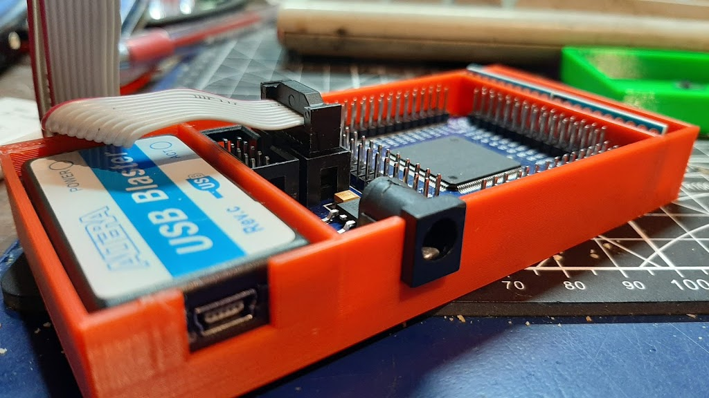

Here's a case for the Cyclone II EP2CT5 board 
 
 
 
EDIT 02/09/2019: Updated version that includes a section for two 8-channel 5V-3.3V level converter boards. 
EDIT 08/09/2019: Updated design, mounting holes now are inline with the PCBs, download STL v5 file. 
