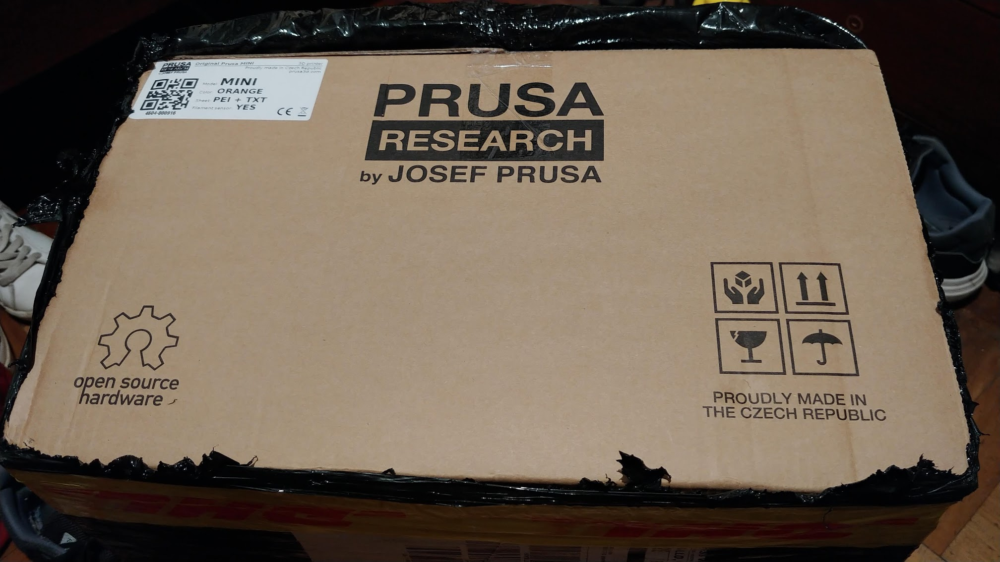
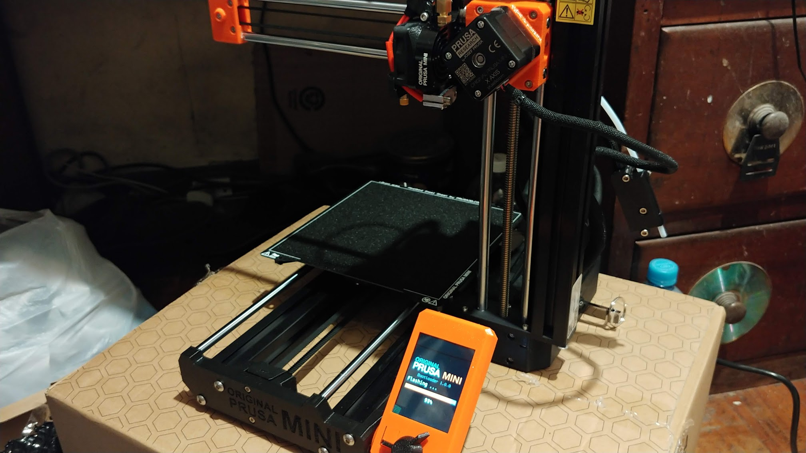
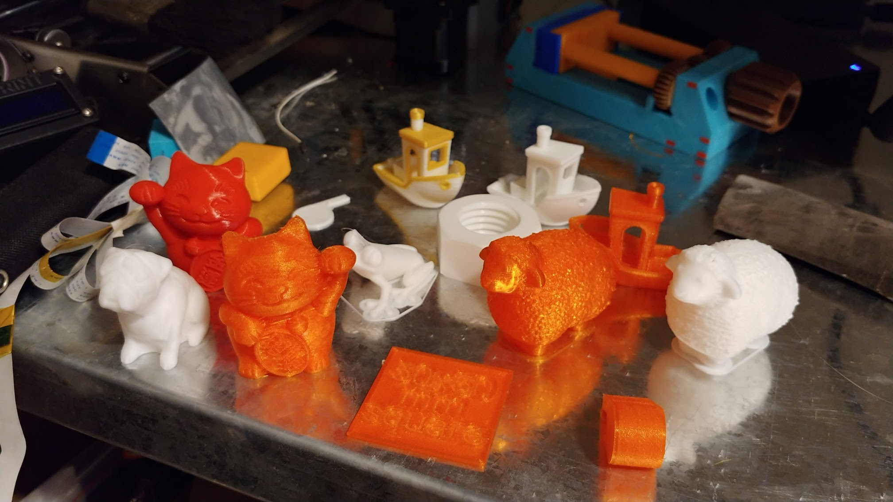
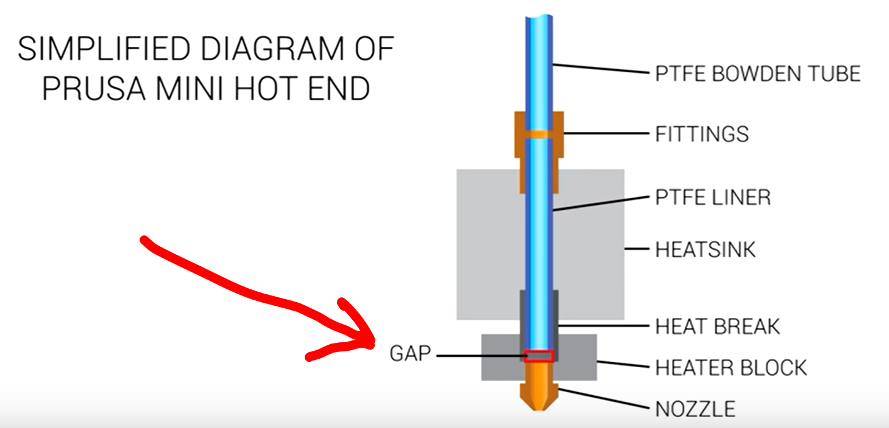

This is a log and adquired experience in using a Prusa Mini 3D FDM printer:

<b>14/10/2019:</b> Ordered my Prusa Mini with filament sensor and both bed sheets (smooth and rugged) 
<b>21/02/2020:</b> Arrived my Prusa Mini! Took only an hour to assemble it 
 
 
<b>22/02/2020:</b> First 3D prints, all went okay but had some issues in loading/unloadind filament. 
Printed some cable relief for the ones that goes to the hotend (https://www.thingiverse.com/thing:4082541). 
 
<b>01/03/2020:</b> Disassembled the hotend because of a clog, after an exhaustive visual checking I found lots of debris in the heatbreak exactly where the PTFE sits. After assemblying no further under-extrusion or other related filament jamming issues in the hotend or the extruder. 
<b>03/03/2020:</b> Michael from Teaching Tech showed this clogging problem on his new arrived Prusa Mini (https://www.youtube.com/watch?v=D0QoeqRFd0U&fbclid=IwAR2XoVGGpD4-eI6OcnACPBZOlZoC7dF4nP-0auU9gn-wuQkn32bGfOJUF64). The main issue is that some Prusa Mini printers were wrongly assembled at the hotend part, leaving a small gap between the ptfe tube and the heatbreak: 
 
<b>22/03/2020:</b> Found a cover for the display unit of the Prusa Mini (https://www.thingiverse.com/thing:4230690), great design! Thanks Sven de Ruiter! 
 
